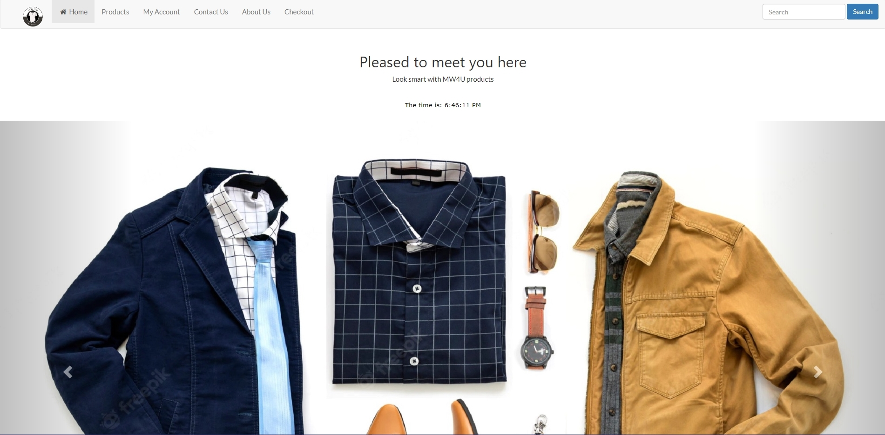

# Team14

MW4U is a e-commerce site that sells clothing marketed towards men. The website's insipration was sites such as gymshark that sell clothing that is tailored to a specific target market. It was created during the CS2TP module and had a team of 8 people.

Languages/Technologies Used: HTML/CSS/PHP/JavaScript/MySQL/Bootstrap

Preview:

